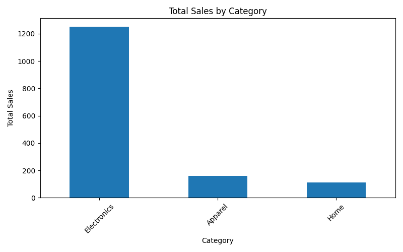

# Sales Data Analysis 📊

This project performs basic data analysis on a sample sales dataset using Python and pandas. It demonstrates how to load, inspect, and summarize sales data, as well as visualize sales by category, region, and product.

---

## 📁 Dataset

The dataset is a small mock dataset for practice purposes. It includes:
- Order ID
- Date
- Product
- Category
- Region
- Quantity
- Price
- Total Sales

---

## 🔍 Key Analysis Performed

- Dataset inspection (`.head()`, `.info()`, `.describe()`)
- Total sales by:
  - Product Category
  - Region
  - Product
- Best-selling products by revenue
- (Optional) Bar chart visualization using matplotlib

---

## 🧠 Insights

- **Electronics** is the highest-grossing category.
- **North** region generates the most revenue.
- The **Laptop** product is the best-seller by total sales.

---

## 🛠️ Tools Used

- Python 3
- pandas
- matplotlib (optional, for visualization)

---

## 🚀 How to Run This Project

1. Clone the repo or download the files:

    ```bash
    git clone https://github.com/darielledixon/Sales-Data-Analysis.git
    ```

2. Open the folder in your code editor or terminal.

3. Install required libraries (if not already installed):

    ```bash
    pip install pandas matplotlib
    ```

4. Run the script:

    ```bash
    python3 sales_analysis.py
    ```

---

## 📊 Sample Output

```bash
Total Sales by Category:
Apparel         160
Electronics    1250
Home            110

Total Sales by Region:
North    1200
South     130
East       90
West      100

Best-Selling Products:
Laptop        800
Tablet        300
Headphones    100
```

## 📸 Example Visualization



